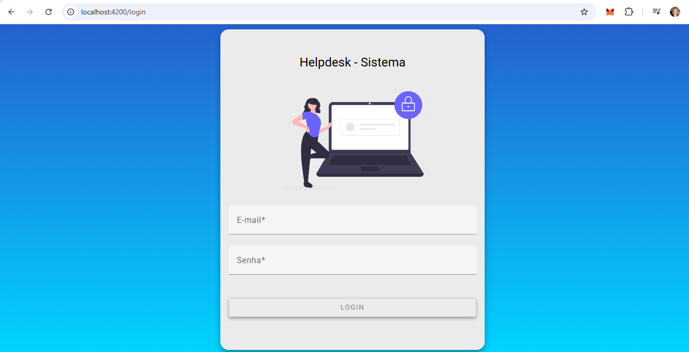

# HelpDesk Frontend 📞🖥️

Este é o **frontend** do sistema **HelpDesk**, desenvolvido com **Angular 15**.  
Permite cadastro e gestão de **Técnicos**, **Clientes** e **Chamados**, com **autenticação JWT** e navegação protegida por guards.

---

### 🧩 Requisitos
- Node.js (versão recomendada: 16+)
- Angular CLI (npm install -g @angular/cli)

---

### 🚀 Tech Stack

- **Framework:** Angular 15+
- **Linguagem:** TypeScript
- **HTTP Client:** Angular HttpClientModule
- **Autenticação:** JWT (AuthInterceptor, AuthService)
- **Guards:** AuthGuard para rotas seguras
- **Router:** Angular Router

---

### ⚙️ Como rodar localmente

### 1️⃣ Clone o repositório

git clone https://github.com/abnobrega/helpdesk-frontend.git

---

### 2️⃣ Acesse o diretório

cd helpdesk-frontend

---

### 3️⃣ Instale as dependências

npm install

---

### 4️⃣ Rode o projeto

ng serve

A aplicação estará disponível em http://localhost:4200.

---

### ✅ Funcionalidades

- Login com autenticação JWT

- Cadastro, edição e exclusão de Técnicos

- Cadastro, edição e exclusão de Clientes

- Cadastro, atualização e consulta de Chamados

- Controle de acesso por perfil de usuário

- Interceptador de requisições com token JWT

- Proteção de rotas com AuthGuard

---

### 🖼️ **Screenshots**

### 🗂️ HELP DESK WEB SYSTEM — MAIN SCREEN

--- 

### 📣 Backend

Este frontend consome a API REST do [HelpDesk Backend](https://github.com/abnobrega/helpdesk-backend).

---

### RESUMO

# HelpdeskProj

This project was generated with [Angular CLI](https://github.com/angular/angular-cli) version 15.0.2.

## Development server

Run `ng serve` for a dev server. Navigate to `http://localhost:4200/`. The application will automatically reload if you change any of the source files.

## Code scaffolding

Run `ng generate component component-name` to generate a new component. You can also use `ng generate directive|pipe|service|class|guard|interface|enum|module`.

## Build

Run `ng build` to build the project. The build artifacts will be stored in the `dist/` directory.

## Running unit tests

Run `ng test` to execute the unit tests via [Karma](https://karma-runner.github.io).

## Running end-to-end tests

Run `ng e2e` to execute the end-to-end tests via a platform of your choice. To use this command, you need to first add a package that implements end-to-end testing capabilities.

## Further help

To get more help on the Angular CLI use `ng help` or go check out the [Angular CLI Overview and Command Reference](https://angular.io/cli) page.

---

### 👨‍💻 Author
- Developed by Alexandre Bonturi Nóbrega
- Independent Full-Stack Web3 Software Engineer
- LinkedIn: https://www.linkedin.com/in/alexandrebonturinobrega/

--- 

### 🗂️ Licença
- Este projeto é de uso pessoal.

---

### ✨ Contato
- Dúvidas ou sugestões? Entre em contato no - LinkedIn: https://www.linkedin.com/in/alexandrebonturinobrega/

